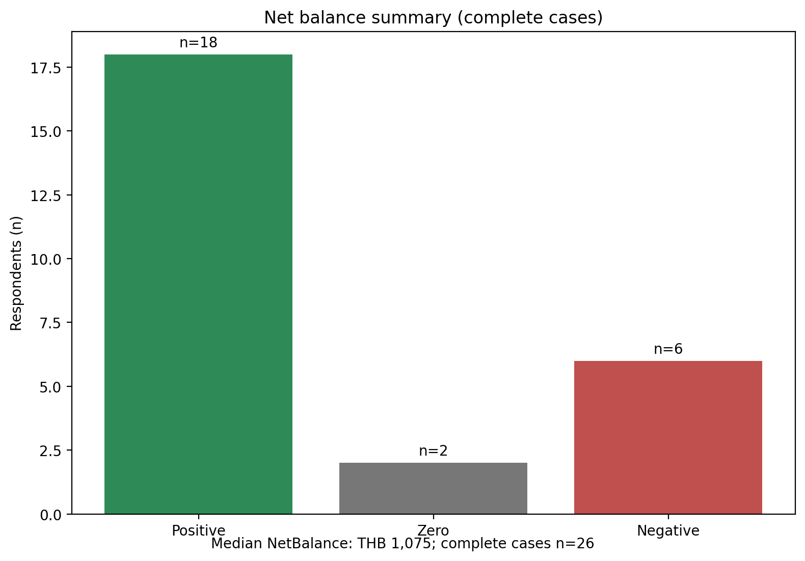
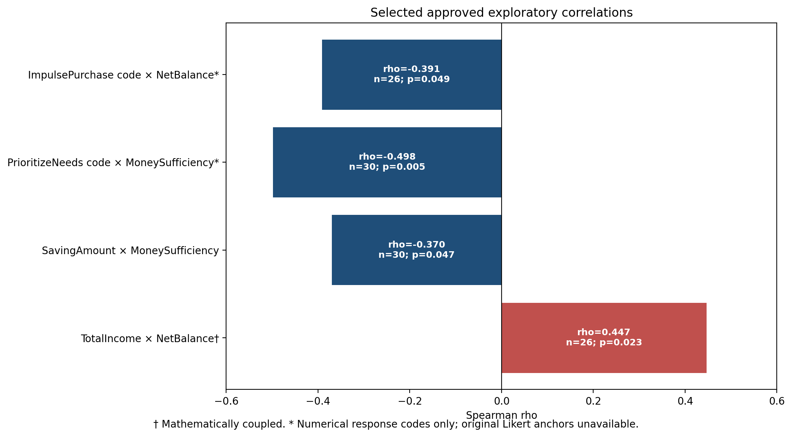

# การวิเคราะห์พฤติกรรมการใช้จ่ายและปัจจัยที่สัมพันธ์กับปัญหาการเงินไม่เพียงพอของนักศึกษามหาวิทยาลัยขอนแก่น

> โครงงาน Data Science ที่ใช้ข้อมูลแบบสอบถามจากนักศึกษามหาวิทยาลัยขอนแก่นจำนวน 30 คน เพื่อสำรวจรูปแบบรายรับ รายจ่าย เงินออม และปัจจัยที่สัมพันธ์กับความเพียงพอทางการเงิน

## 🔎 โปรเจกต์นี้ทำอะไร?

โครงงานนี้เป็นการวิเคราะห์เชิงสำรวจ (Exploratory Data Analysis: EDA) ของกลุ่มตัวอย่างที่ตอบแบบสอบถามโดยสมัครใจ ศึกษารายรับ รายจ่าย เงินออม และความเพียงพอทางการเงินของนักศึกษา พร้อมสร้างตัวชี้วัดทางการเงิน วิเคราะห์ความสัมพันธ์แบบสเปียร์แมน (Spearman Correlation) และตรวจสอบความไวของผลเมื่อมีค่าที่มีอิทธิพลสูง

| หัวข้อ | รายละเอียด |
|---|---|
| กลุ่มตัวอย่าง | นักศึกษา มข. 30 คน |
| วิธีเก็บข้อมูล | แบบสอบถามออนไลน์แบบสมัครใจ |
| รูปแบบข้อมูล | ข้อมูลที่ผู้ตอบรายงานด้วยตนเอง (self-reported) |
| วิธีวิเคราะห์ | EDA, การเปรียบเทียบกลุ่ม, Spearman Correlation, Sensitivity Analysis |
| เครื่องมือหลัก | Python และ Jupyter Notebook |
| ขอบเขต | การวิเคราะห์เชิงสำรวจ ไม่ใช่การอนุมานเชิงสาเหตุ |

## 🎯 คำถามที่ต้องการศึกษา

- รายรับ รายจ่าย และเงินออมของกลุ่มตัวอย่างมีรูปแบบอย่างไร
- `NetBalance` ของกรณีที่คำนวณได้มีลักษณะอย่างไร
- ค่าใช้จ่ายประเภทใดมีสัดส่วนสำคัญ
- `ExpenseRatio` มีความไวต่อค่าที่มีอิทธิพลสูงเพียงใด
- รายรับ รายจ่าย เงินออม และรหัสพฤติกรรมทางการเงินมีความสัมพันธ์เชิงสำรวจกับสถานะทางการเงินหรือไม่

## 🧭 ขั้นตอนการวิเคราะห์

แบบสอบถาม → Data Cleaning → สร้างตัวชี้วัดทางการเงิน → EDA → Group Comparison → Spearman Correlation → Sensitivity Analysis → Insights & Recommendations

## 🧮 ตัวชี้วัดสำคัญ

| ตัวชี้วัด | ความหมาย |
|---|---|
| `NetBalance` | `TotalIncome − TotalExpense` ใช้สะท้อนยอดคงเหลือทางการเงิน |
| `ExpenseRatio` | `TotalExpense / TotalIncome × 100` โดยไม่คำนวณเมื่อรายรับหรือรายจ่ายขาดหาย หรือ `TotalIncome = 0` |
| `CategoryRatio` | `CategoryExpense / TotalExpense × 100` เพื่อดูสัดส่วนรายจ่ายแต่ละหมวด |

## 📊 ผลการวิเคราะห์ที่สำคัญ

| ประเด็น | ผลที่ได้รับการอนุมัติ |
|---|---|
| รายรับ | ค่ามัธยฐาน `TotalIncome` = **THB 8,000** (n=29) |
| รายจ่าย | ค่ามัธยฐาน `TotalExpense` = **THB 10,100** (n=27) |
| ยอดคงเหลือ | จาก 26 กรณีที่คำนวณได้: บวก 18, ศูนย์ 2, ลบ 6 |
| รายจ่ายเด่น | อาหาร: มัธยฐาน THB 4,800, สัดส่วนมัธยฐาน 52.54%; ที่พัก: THB 3,500, 29.55% |
| เงินออมและความเพียงพอ | `SavingAmount × MoneySufficiency_Code`: rho = -0.370, n=30, permutation p=0.047, **ระดับอ่อน (Weak)** |

ค่ามัธยฐานรายรับและรายจ่ายข้างต้นใช้จำนวนข้อมูลที่ใช้ได้ต่างกัน จึงไม่ควรตีความว่าเป็นการเปรียบเทียบรายรับและรายจ่ายแบบรายบุคคล





### การตรวจสอบความไวของ `ExpenseRatio`

พบค่าที่ผ่านการตรวจสอบและมีอิทธิพลสูง ซึ่งส่งผลต่อค่าเฉลี่ยอย่างมาก แต่ค่ามัธยฐานและพิสัยระหว่างควอไทล์ (Interquartile Range: IQR) มีเสถียรภาพกว่า การวิเคราะห์ความไวเป็นเพียงการตรวจสอบอิทธิพลของค่านั้น ไม่ใช่ข้อมูลที่แก้ไขแล้วหรือผลที่ควรเลือกใช้แทนผลหลัก

## ⚠️ การตีความสหสัมพันธ์และรหัสพฤติกรรม

**Correlation ≠ Causation** — ความสัมพันธ์ไม่ใช่เหตุและผล

`TotalIncome × NetBalance` มี mathematical coupling เพราะ `NetBalance = TotalIncome − TotalExpense` จึงไม่ควรตีความค่าสหสัมพันธ์นี้เป็นหลักฐานอิสระทั้งหมด นอกจากนี้รหัสคำตอบ Likert ดั้งเดิมไม่พร้อมใช้งาน จึงรายงานความสัมพันธ์ของรหัสพฤติกรรมเชิงตัวเลขได้ แต่ไม่ตีความว่ารหัสสูง/ต่ำหมายถึงพฤติกรรมดีขึ้น แย่ลง เห็นด้วยมากขึ้น หรือเกิดบ่อยขึ้น

## 📁 โครงสร้าง Repository

```text
KKU-Financial-DataScience/
├── README.md                         หน้าหลักของโครงการ
├── notebooks/Final_Project_Analysis.ipynb
├── src/                              สคริปต์วิเคราะห์และสร้างภาพสาธารณะ
├── outputs/
│   ├── tables/                       ตารางสรุปแบบ aggregate
│   └── figures/public/               ภาพสรุปที่ปลอดภัยต่อการเผยแพร่
├── docs/                             ระเบียบวิธีและเอกสารกำกับ
├── data/                             นโยบายข้อมูลและคำอธิบายการยกเว้นข้อมูลส่วนบุคคล
└── requirements.txt
```

## 🚀 เริ่มดูโปรเจกต์จากตรงไหน?

1. อ่าน README นี้
2. เปิด [Notebook สรุปการวิเคราะห์](notebooks/Final_Project_Analysis.ipynb)
3. ดู [ภาพสรุปสาธารณะ](outputs/figures/public/)
4. ดู [ตารางผลสรุป](outputs/tables/)
5. อ่าน [เอกสารประกอบ](docs/)

## 💻 การใช้งาน

```powershell
git clone https://github.com/ChitsanuphongSu/KKU-Financial-DataScience.git
cd KKU-Financial-DataScience
python -m venv .venv
.venv\Scripts\activate
pip install -r requirements.txt
jupyter notebook notebooks/Final_Project_Analysis.ipynb
```

Notebook สาธารณะเป็น walkthrough ระดับผลสรุป (aggregate-level) การสร้าง pipeline แบบครบถ้วนต้องใช้ข้อมูลต้นทางส่วนบุคคลที่ไม่ได้เผยแพร่

## 🔒 ความเป็นส่วนตัวของข้อมูล

GitHub repository นี้ตั้งใจไม่เผยแพร่ข้อมูลแบบสอบถามดิบ ข้อมูลประมวลผลระดับผู้ตอบ ตารางตรวจสอบระดับผู้ตอบ ภาพที่แสดงจุดสังเกตการณ์รายบุคคล และ PowerPoint สำหรับชั้นเรียนที่มีภาพภาคผนวกระดับผู้ตอบ สิ่งที่เผยแพร่ใช้เฉพาะผลสรุปแบบ aggregate หรือภาพที่ผ่านการทำให้ปลอดภัยแล้ว

## ⚠️ ข้อจำกัด

- กลุ่มตัวอย่างสมัครใจ มีจำนวน 30 คน และเป็นข้อมูล self-reported
- อาจมีความคลาดเคลื่อนจากการระลึก การประมาณค่า หรือการปัดเศษ
- จำนวนข้อมูลที่ใช้ได้แตกต่างกันตามตัวแปร
- ไม่พบ anchors ของ Likert scale ดั้งเดิม
- สหสัมพันธ์เป็นการสำรวจ และไม่ควรสรุปแทนนักศึกษา มข. ทุกคน

## 📚 เอกสารเพิ่มเติม

- [ระเบียบวิธีวิเคราะห์](docs/methodology.md)
- [พจนานุกรมข้อมูล](docs/data_dictionary.md)
- [บันทึกการทำความสะอาดข้อมูล](docs/cleaning_log.md)
- [การตรวจสอบความเป็นส่วนตัว](docs/data_privacy_audit.md)
- [บันทึกการตรวจสอบ repository](docs/repository_audit.md)
- [Notebook สาธารณะ](notebooks/Final_Project_Analysis.ipynb)
